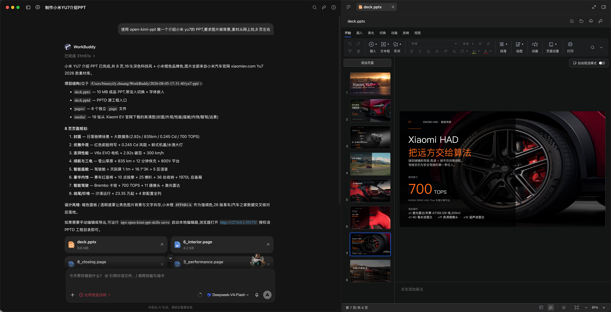
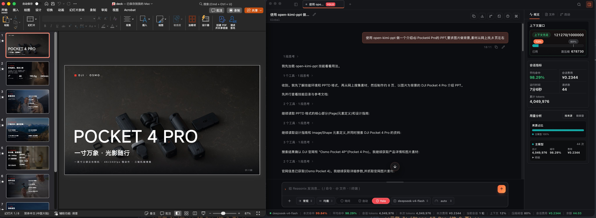

# open-pptd-skills

[简体中文](README.md) | [English](README_EN.md)

[](https://www.npmjs.com/package/open-pptd-skills)
[](https://nodejs.org)

An open-source presentation skill for AI coding agents. It lets your agent create, edit, replicate, read, and export PPT/PPTX files. **Every run delivers two outputs by default: an editable PPTD project and a ready-to-use PPTX** — fade transitions included — plus a local in-browser PPTD viewer. Works with Codex, Claude Code, Cursor, WorkBuddy, and any agent that supports the SKILL.md format.

> [!IMPORTANT]
> This project uses the PPTD format as an intermediate layer and exports PPTX through a local OOXML engine. It runs entirely locally with no remote editor or external service dependencies.

## Install

Node.js 18 or later is required.

**Pick one method — do not run both**, or you may end up with duplicate installs across directories. By default the skill lands in the shared directory `~/.agents/skills/open-pptd` (Windows: `%USERPROFILE%\.agents\skills\open-pptd`). For most agents that discover that path, a single install is enough.

### Option 1: Automatic install (recommended)

Ask your agent with either of these prompts and let it install for you:

```text
Install the open-pptd skills from GitHub for me.
```

```text
Install https://github.com/Binaryify/open-pptd-skill for me.
```

After that, you usually do **not** need to run `npx ... install` yourself.

### Option 2: Manual install

Run this in your terminal:

```bash
npx open-pptd-skills install
```

Only add `--target` if your agent **does not** pick up `~/.agents/skills` and must use its own skills directory (paths below are for macOS / Linux; on Windows replace `~` with `%USERPROFILE%`, e.g. `%USERPROFILE%\.codex\skills`):

```bash
# Codex
npx open-pptd-skills install --target ~/.codex/skills

# Claude Code
npx open-pptd-skills install --target ~/.claude/skills

# Cursor
npx open-pptd-skills install --target ~/.cursor/skills

# WorkBuddy
npx open-pptd-skills install --target ~/.workbuddy/skills
```

> Do not install once per agent by default. Start with the shared directory; only use `--target` for an agent that cannot discover the skill there.

### Update

When the skill is updated, run install again — it overwrites the local installation:

```bash
npx open-pptd-skills@latest install
```

If you originally installed with `--target`, pass the same path again:

```bash
npx open-pptd-skills@latest install --target ~/.claude/skills
```

You can also ask your agent: `Update the open-pptd skill for me.` Updating only replaces the skill files; it does not touch PPTD / PPTX projects you already generated.

## Usage

### Generate a presentation with your agent

Once installed, just describe what you need. **You always get two deliverables by default**: the complete, editable PPTD project directory and the matching PPTX file. PPTX generation is skipped only when you explicitly ask for PPTD-only output.

For more stable quality, put a style in the prompt (e.g. “dark product-launch look”) or attach a reference PPT template; topic-only prompts without style guidance tend to vary more.

```text
Use open-pptd to create a liquid-glass-style deck about the history of Apple.
```

**Example: Xiaomi YU7 (~8 pages, images as backgrounds)**

```text
Use open-pptd to create a Xiaomi YU7 intro PPT, with images as backgrounds from the web, about 8 pages.
```

[](docs/images/example-workbuddy-yu7.png)

**Example: iPhone 17 Pro (~8 pages)**

```text
Use open-pptd to create an iPhone 17 Pro intro PPT.
```

[](docs/images/example-iphone-17pro.png)

### Edit online and export manually

Prefer asking your agent to start the local editor, for example:

```text
Run npx open-pptd-skills serve for me.
```

Or run it yourself in a terminal:

```bash
npx open-pptd-skills serve
```

Then open <http://127.0.0.1:55173/> and choose a complete project folder containing the `.pptd` manifest, `pages/`, and `media/` to view, edit, and export PPTX in the browser. The bundled [example/dji-pocket4](example/dji-pocket4) project — a complete 18-page deck — is ready to open for a quick tour.

```bash
# Open the browser after startup
npx open-pptd-skills serve --open

# Use another port
npx open-pptd-skills serve --port 56000
```

Writable folder access requires a Chromium-based browser with the File System Access API. Other browsers fall back to read-only folder upload. Press `Ctrl+C` to stop the server.

## Features

- **PPTD generation**: let your agent generate complete, editable PPTD projects — from scratch, with style transfer, template reuse, or replication from images/PDFs.
- **PPTX generation**: produce a matching PPTX by default, with fonts embedded and fade transitions written automatically.
- **Visual QA**: with a multimodal model, the skill exports every page as an image, stitches them into an overview sheet, and checks each page (distortion, occlusion, out-of-bounds elements, contrast, layout consistency, text overflow) before PPTX export — fixing and re-checking until every page passes.
- **Online editing**: view and edit local PPTD projects in a browser, with autosave and configurable slide transitions.
- **Manual export**: export PPTX manually from the editor at any time.
- **Format conversion**: convert existing PPTX files to PPTD for further editing.
- **Secure by design**: local editing only reads and writes project directories explicitly authorized by the user.

## Why open-pptd

Most PPT skills fall into three buckets: assemble OOXML / pptxgenjs in code, render each slide as a full-bleed image, or ship a swipeable HTML deck. open-pptd takes a **PPTD intermediate layer + real editable PPTX** path — easy for agents to write, good to look at, and still editable in PowerPoint.

| | open-pptd | Code-built PPTX (e.g. pptxgenjs) | Full-slide image PPT | Web HTML PPT |
| --- | --- | --- | --- | --- |
| Deliverable | PPTD project + PPTX | Usually PPTX only | Usually PPTX only | Single HTML file |
| Agent-friendly | Clear per-page YAML | Lots of coordinates/API detail | Depends on image models & prompts | Strong HTML/CSS template constraints |
| Editable in PowerPoint | Text, shapes, images stay editable | Editable, but hard to refine later | Flat bitmaps — hard to reword | Not native PPTX |
| Visual quality | Real layouts + multimodal QA before export | Relies on agent layout tuning | Cohesive, poster-like | Strong motion; great for live demos |
| Re-editing | Browser visual editor + autosave | Mostly re-run code | Usually regenerate images | Edit HTML source |
| Best for | Formal PPTX you still need to tweak | Structured reports / template fills | Visually unified poster decks | In-browser talks / launches |

In short:

1. **DSL built for agents** — PPTD describes theme, layout, and elements in YAML, more stable than raw OOXML / pptxgenjs, and more locally editable than full-slide images.
2. **Two deliverables by default** — an iterable PPTD project plus a ready-to-open PPTX (embedded fonts, fade transitions).
3. **Truly editable PPTX** — text boxes and shapes remain editable in PowerPoint / WPS, unlike image-only decks.
4. **Local visual editor** — preview, tweak, set transitions, and re-export in the browser without rerunning the whole agent flow.
5. **Visual QA before export** — full-page screenshots plus an overview sheet catch occlusion, overflow, contrast, and layout issues before PPTX is written.
6. **Not locked to any specific model — lower cost** — you can run this in any compatible agent with cheaper models such as DeepSeek. Even without multimodal vision, a model that follows the PPTD spec can still produce strong decks (multimodal helps more with the visual QA pass).

[](docs/images/example-deepseek-liquid-glass.png)

*Above: an Apple Liquid Glass-style deck generated with DeepSeek-V4-Flash in WorkBuddy.*

[](docs/images/example-reasonix-deepseek.png)

*Above: a DJI Pocket 4 Pro deck generated with DeepSeek-V4-Flash in Reasonix.*

[](docs/images/example-codex-iphone17pro.png)

*Above: an iPhone 17 Pro deck generated with the 5.6 Luna model in ChatGPT / Codex — fast and strong.*

### Style and themes

This skill **does not ship a fixed theme or template**. You choose the look.

> [!TIP]
> **Best results come from stating a PPT style in the prompt, or attaching a reference PPT / PPTX template.** With a style constraint or template to follow, output quality is clearly better and more stable. Topic-only prompts leave the agent free to invent a look, so results vary more.

Common approaches:

1. **Describe the style in the prompt** — e.g. dark tech, magazine layout, Apple liquid glass, minimal big-type poster slides;
2. **Provide a reference template** — upload an existing PPT / PPTX / screenshot and ask the agent to transfer colors, layout, and overall style.

You can combine both: lock the look with a template, then add one line about the style you want to emphasize.

## Screenshots

| Edit PPTD online | Export PPTX |
| :---: | :---: |
| [](docs/images/editor-overview.png) | [](docs/images/export-pptx.png) |

## What is PPTD

PPTD is a YAML-based presentation DSL — a simplified abstraction layer over OOXML. It preserves the essentials (theme, page layout, element positions) while dropping complex nesting such as Masters; every page is self-contained — what you see is what you get. See [reference/pptd.md](skills/open-pptd/reference/pptd.md) for the complete definition.

A complete PPTD project looks like this:

```text
deck/
  deck.pptd     # manifest
  pages/        # one .page file per slide
  media/        # local media assets (if any)
  deck.pptx     # PPTX generated by default
```

## How it works and security boundaries

- The CLI serves static files on `127.0.0.1` only and does not listen on LAN interfaces.
- The browser reads a complete PPTD project directory only after explicit user authorization.
- Save callbacks may only modify `.pptd` and `.page` files; absolute paths and `..` traversal are rejected.
- All exports (PPTX, HTML, images) run entirely locally with no remote editor or external service dependencies.
- PPTX export uses a local OOXML engine (`open-ppt-engine`) that compiles YAML pages into OOXML format via Node.js.

## Compatibility

PPTX export uses a local OOXML engine to generate standard OOXML format, compatible with PowerPoint, WPS, and Keynote. Successfully generating a PPTX does not guarantee identical animation playback across all players.

## Local development

```bash
npm install --global .
npm test
npm run pack:check
```

## Legal

All trademarks belong to their respective owners.
